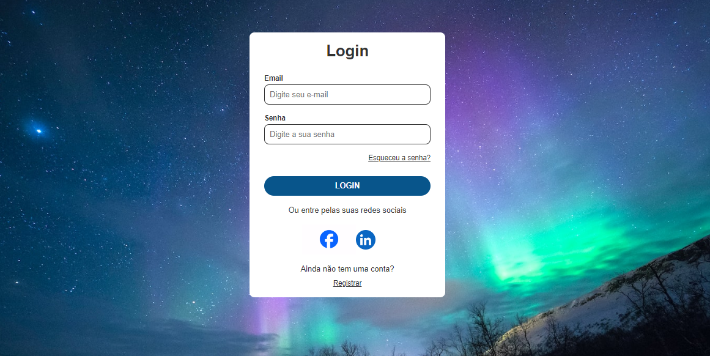

<h1> Projeto Tela de Login</h1>
 
 
<h2>O projeto que desenvolvi consiste em uma tela de login simples, projetada para oferecer aos usuários uma forma fácil e segura de acessar um sistema ou aplicativo. Com uma interface minimalista e intuitiva, o objetivo principal é fornecer uma experiência de login rápida e eficiente.    
  Recursos Principais:    
Formulário de Login Intuitivo: A tela de login apresenta um formulário simples com campos para inserir o nome de usuário (login) e senha. Os campos são claramente identificados, facilitando o entendimento e preenchimento por parte dos usuários.    
  Estilo Atraente com CSS: O design da tela de login é melhorado com o uso de CSS para aplicar estilos visuais atraentes e uma disposição organizada dos elementos. Utilizei técnicas de design responsivo para garantir que a tela de login seja exibida corretamente em uma variedade de dispositivos e tamanhos de tela.     
  Conclusão:    
A tela de login simples que desenvolvi oferece uma solução eficaz e confiável para autenticação de usuários em sistemas e aplicativos. Com uma abordagem focada na simplicidade e usabilidade, o projeto proporciona uma experiência de login suave e sem complicações, ao mesmo tempo em que mantém a segurança e a integridade dos dados do usuário.
</a> </h2>
 
 
  <h3> Tecnologias Utilizadas </h3>
     
    
  
 

 
